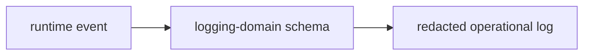

# @ocentra-parent/logging-domain

Parent-local logging helpers, redaction-safe proof coverage, and bridge/query adapters over Rust-owned logging contracts.

## Role

- Consume Rust-owned logging contracts.
- Provide local development observability helpers and bridge/query adapters.
- Keep TypeScript limited to thin edge validation, local fixtures, and redaction-safe wrappers.

## Must Not Own

- Canonical logging contract authority.
- Raw child evidence.
- Parent report content.
- Sensitive screenshots, browser history, or message content.
- Feature-specific policy decisions.

## Flow

## Architecture Split

This package now serves two distinct parent logging modes plus one explicit infra scope.

### Local Dev Observability

Local-only developer and test logging uses:

- bridge-compatible NDJSON rows
- local DuckDB query helpers
- parent-local scopes such as `parent-portal`, `parent-agent`, `parent-codex`, and `parent-test`
- MCP-first query access through `npm run mcp:logging` for Codex and local agents
- CLI fallback through `npm run agent:query` and `npm run codex:evidence` when MCP wiring is unavailable

These artifacts are workspace-owned local evidence. They are not uploaded to Ocentra services by default. They are not production support bundles and they are not child-data custody claims.

### Product / Runtime Safe Logging

The existing proof/read-model exports remain the product-safe consumption surface:

- redaction-safe
- explicit custody boundaries
- no raw child activity by default
- Rust remains the contract authority

### Cloudflare Infra Logging

Cloudflare stays separate as explicit `parent-cloudflare` scope. Parent-local generic logging must not default to Cloudflare.

## Parent Routing Notes

- Portal dev logs should prefer the local bridge transport when available.
- `/api/dev/log-snapshot` is a snapshot/status endpoint for the Rust agent service. It is not the primary local log store.
- The Rust agent service still has a compatibility local NDJSON writer until WP04 moves that path into `crates/logging-core`.

## Connected Docs

- [Notification expectations](../../docs/expectations/notifications.md)
- [Data custody expectations](../../docs/expectations/data-custody.md)
- [Static analysis and security expectations](../../docs/expectations/static-analysis-security.md)

## Contract Detail

- [Notification and tamper integrity](docs/contracts/notification-and-tamper-integrity.md)
- [Support bundle and upload workflow](docs/contracts/support-bundle-and-upload-workflow.md)
- [Support backend custody and readiness](docs/contracts/support-backend-custody-and-readiness.md)
- [Provider secret and privacy disclosure](docs/contracts/provider-secrets-and-privacy.md)
- [Status payload, export, and deletion](docs/contracts/status-payload-export-and-deletion.md)

## Gaps To Fill

- Keep log contracts aligned with every new remote, notification, and support
  path.
- Add runtime writers only after the notification provider and history surfaces
  have real contracts and validation.
- Add runtime support bundle writers only after production support backend,
  account lookup, billing escalation, remote support, privacy/legal publication,
  and SLA workflows have real contracts and validation.
