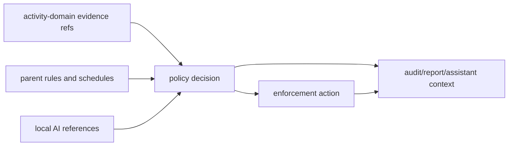

# @ocentra-parent/parent-domain

Shared product contracts for family safety, policy, enforcement, local AI, LAN,
mobile readiness, and control catalogs.

## Owns

- Parent/family/child/device product contracts.
- Policy rules, schedules, targets, decisions, permissions, and audit shapes.
- Enforcement intents, results, capability states, timers, and readiness.
- Local AI runtime, provider, scheduler, context, and reference contracts.
- Parent assistant and action-preview contracts.
- LAN pairing, device roles, controller/observer states, and provider routing.
- Browser/app/game/network/screen/tracking control catalogs.
- Android/iOS/platform proof and capability status contracts where product
  meaning belongs in TypeScript first.

## Must Not Own

- Raw evidence payloads that belong in `activity-domain`.
- WebSocket envelopes that belong in `agent-protocol-domain`.
- Portal route/layout details.
- Platform adapter implementation.
- Billing provider SDK logic.

## Flow

## Connected Docs

- [Policy expectations](../../docs/expectations/policy.md)
- [Enforcement expectations](../../docs/expectations/enforcement.md)
- [AI expectations](../../docs/expectations/ai.md)
- [Parent assistant expectations](../../docs/expectations/parent-assistant-chat.md)
- [LAN pairing expectations](../../docs/expectations/lan-pairing.md)
- [Platform expectations](../../docs/expectations/platforms.md)
- [Competitor capability map](../../docs/competitor-capability-map.md)

## Gaps To Fill

- Family setup, child profiles, co-parent roles, and recovery need complete
  product contracts and UI flow.
- Social/message/video controls need explicit product contracts, privacy
  boundaries, and platform source rules.
- Location/geofence/SOS/battery needs runtime contracts and platform proof.
- Store/install approval and purchase controls need platform-specific scope.
- Billing/subscription entitlements need to stay outside core safety decisions.
