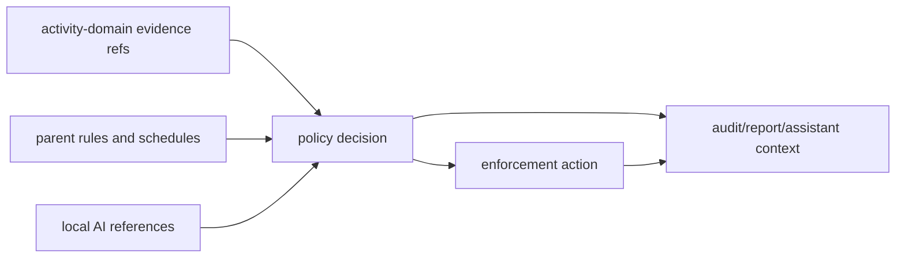

# @ocentra-parent/parent-domain

Shared product contracts for family safety, policy, enforcement, local AI, LAN,
mobile readiness, and control catalogs.

## Owns

- Parent/family/child/device product contracts.
- Policy rules, schedules, targets, decisions, permissions, and audit shapes.
- Enforcement intents, results, capability states, timers, and readiness.
- V0.8 enforcement product-control spine contracts that separate implemented,
  degraded, dry-run, manual-required, unavailable, and not-claimed states.
- V0.8 enforcement policy-dispatch contracts that validate parent-authored
  intents, evidence refs, adapter matrix rows, timer/approval/audit state, and
  child-facing reason codes before dispatch-ready claims.
- V0.8 enforcement integrity runtime audit contracts that link supported action
  results, timer recovery/rollback, child-status refs, parent-override audit
  refs, permission-loss, integrity heartbeat, and tamper/manual states.
- Local AI runtime, provider, scheduler, context, and reference contracts.
- Parent assistant and action-preview contracts.
- LAN pairing, device roles, controller/observer states, and provider routing.
- Browser/app/game/network/screen/tracking control catalogs.
- Android/iOS/platform proof and capability status contracts where product
  meaning belongs in TypeScript first.

## Must Not Own

- Raw evidence payloads that belong in `activity-domain`.
- WebSocket envelopes that belong in `agent-protocol-domain`.
- Portal route/layout details.
- Platform adapter implementation.
- Billing provider SDK logic.

## Flow

## Connected Docs

- [Policy expectations](../../docs/expectations/policy.md)
- [Enforcement expectations](../../docs/expectations/enforcement.md)
- [AI expectations](../../docs/expectations/ai.md)
- [Parent assistant expectations](../../docs/expectations/parent-assistant-chat.md)
- [LAN pairing expectations](../../docs/expectations/lan-pairing.md)
- [Platform expectations](../../docs/expectations/platforms.md)
- [Competitor capability map](../../docs/competitor-capability-map.md)

## Gaps To Fill

- Family setup, child profiles, co-parent roles, and recovery need complete
  product contracts and UI flow.
- Social/message/video controls need explicit product contracts, privacy
  boundaries, and platform source rules.
- Location/geofence/SOS/battery needs runtime contracts and platform proof.
- Store/install approval and purchase controls need platform-specific scope.
- Billing/subscription entitlements need to stay outside core safety decisions.
- V0.8 broad app, network/domain, exact URL, notification, and tamper controls
  remain manual-required or not-claimed until platform adapter proof exists.
- Policy-dispatch proof is currently service/read-model proof; finished
  parent/child UX, notification delivery, network/domain blocking, broad app
  blocking, and tamper protection remain proof-gated gaps.
- Supported-adapter and integrity runtime audit proof remain contract/read-model
  proof; broad app/domain/browser blocking, notification delivery, tamper
  resistance, mobile enforcement, stealth/persistence, and privilege escalation
  remain unclaimed.
