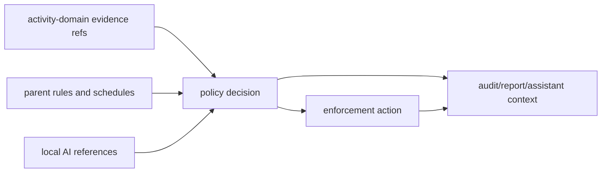

# @ocentra-parent/parent-domain

Shared product contracts for family safety, policy, enforcement, local AI, LAN,
mobile readiness, and control catalogs.

## Owns

- Parent/family/child/device product contracts.
- Policy rules, schedules, targets, decisions, permissions, and audit shapes.
- Enforcement intents, results, capability states, timers, and readiness.
- V0.8 enforcement product-control spine contracts that separate implemented,
  degraded, dry-run, manual-required, unavailable, and not-claimed states.
- V0.8 enforcement policy-dispatch contracts that validate parent-authored
  intents, evidence refs, adapter matrix rows, timer/approval/audit state, and
  child-facing reason codes before dispatch-ready claims.
- V0.8 enforcement integrity runtime audit contracts that link supported action
  results, timer recovery/rollback, child-status refs, parent-override audit
  refs, permission-loss, integrity heartbeat, and tamper/manual states.
- V0.8 integrity alert/status bridge contracts that expose permission-loss,
  stale-heartbeat, stopped-or-removed, and tamper/manual parent-visible status
  rows with notification intent/status refs, audit refs, integrity refs, and
  drill-in refs.
- V0.8 notification provider status boundary contracts that represent queued,
  delivered, failed, unavailable, and manual-required provider states plus
  quiet-hours/escalation readiness as read-model proof without provider
  delivery claims.
- Notification local outbox adapter-boundary contracts that represent a
  parent-owned local outbox artifact, minimal alert envelopes, provider-channel
  abstraction, quiet-hours defer, retry, dead-letter, receipt-required, and
  manual-required states without provider delivery, receipt ingestion,
  credentials, cloud routing, parent UI, or sensitive detail storage claims.
- Notification local outbox scheduler proof contracts that represent
  deterministic due, held quiet-hours, retry-window, dead-letter review,
  receipt-required, and manual-required scheduler states with parent-owned
  artifact write/read proof, without provider delivery, receipt ingestion,
  credentials, cloud routing, parent UI, production durable storage, or
  sensitive detail storage claims.
- Local AI runtime, provider, scheduler, context, and reference contracts,
  including screen summary context-builder replay proof from deleted local OCR
  evidence refs.
- Parent assistant and action-preview contracts.
- LAN pairing, device roles, controller/observer states, and provider routing.
- Billing/subscription entitlement contracts for plan rows, subscription status,
  device-limit decisions, failure behavior, retained evidence export, and
  local-safety continuation without billing provider SDK ownership.
- Billing entitlement runtime proof contracts for local runtime/status
  consumption of account entitlement snapshots, device-limit decisions, and
  billing failure states without live provider execution, provider contact,
  refund/credit runtime, child custody, production billing claims, or portal UI.
- Billing support/admin boundary proof contracts for support-case triage,
  account-status review, billing escalation request, provider-contact/manual,
  entitlement-admin-override/manual, refund-credit/manual states, redaction
  audit refs, and no provider/backend/admin runtime claims.
- `production-support-publication-workflow-proof` contracts for public privacy
  policy publication, privacy/legal disclosure execution, support runbook
  publication, support incident status publication, support backend upload
  publication handoff, and public support contact publication while keeping real
  public runtime, support upload execution, account lookup, billing contact,
  production SLA, legal execution, remote support, and child custody unclaimed.
- Parent-owned sync/export and stateless report compiler status contracts for
  parent-authorized remote compilation from parent-owned storage, source
  connector/cursor refs, requested data classes and time windows, temp TTL and
  deletion confirmation, redaction/minimization, audit refs, and custody
  non-mutation boundaries.
- Parent-owned local export/delete runtime-state contracts for
  parent-authorized Windows local export queues, encrypted local output
  metadata, delete confirmation/failure, offline/manual states, source evidence
  retention for local safety, and no cloud/provider/UI/custody overclaims.
- App install/purchase runtime proof boundary contracts that link platform/store
  metadata requirements, package-source artifact requirements, child
  pending/result delivery rows, report integration rows, and child status
  runtime readiness rows while keeping provider/store, runtime status reader,
  child-device delivery, runtime report delivery, and app blocking unclaimed.
- App install/purchase platform artifact proof contracts that attach
  parent-owned platform/store metadata artifact refs and report-runtime evidence
  refs to the existing runtime boundary while keeping provider/store APIs,
  platform adapters, child-device delivery, runtime report delivery, and app
  blocking unclaimed.
- App install/purchase child artifact delivery proof contracts that attach
  child package-source artifact refs and child-facing pending/result delivery
  artifact refs to the existing runtime/platform proof boundary while keeping
  production child-device capture, delivery, runtime report delivery,
  provider/store APIs, platform adapters, interception, and app blocking
  unclaimed.
- App install/purchase approved API/entitlement proof contracts that attach
  approved store API evidence refs, entitlement evidence refs, limitation report
  refs, and audit refs to child artifact rows while keeping provider execution,
  store integration, platform adapters, child delivery, runtime report delivery,
  interception, child activity data, and app blocking unclaimed.
- App install/purchase report runtime proof contracts that link app-install
  report surfaces and child artifact refs to stateless report compiler
  status/result refs while keeping portal report UI, runtime report delivery,
  provider/store execution, platform adapters, child-device delivery, child
  activity data, app blocking, and Ocentra-hosted family data custody
  unclaimed.
- App install/purchase platform adapter boundary proof contracts that link
  approved API/entitlement evidence rows and report-runtime refs to platform
  adapter readiness/manual/unavailable rows while keeping actual adapter
  implementation, provider execution, store integration, child delivery, report
  delivery, interception, child activity data, app blocking, and Ocentra-hosted
  family data custody unclaimed.
- App install/purchase parent review action proof contracts that link
  approve/deny/time-box/review-needed decision actions to approved API/
  entitlement evidence refs and report-runtime refs while keeping portal
  approval UI, parent action runtime delivery, provider/store execution,
  platform adapters, child-device delivery, child activity data, app blocking,
  and Ocentra-hosted family data custody unclaimed.
- App install/purchase parent action runtime handoff proof contracts that link
  parent review actions to runtime handoff status rows and platform adapter
  boundary refs while keeping portal approval UI, runtime action writer
  implementation, parent action runtime delivery, provider/store execution,
  platform adapter implementation, child-device delivery, runtime report
  delivery, child activity data, app blocking, and Ocentra-hosted family data
  custody unclaimed.
- App install/purchase store status handoff proof contracts that link parent
  action runtime handoff rows and platform adapter boundary rows to per-store
  status handoff states while keeping provider/store execution, platform
  adapter implementation, parent action runtime delivery, child-device
  delivery, runtime report delivery, interception, child activity data, app
  blocking, and Ocentra-hosted family data custody unclaimed.
- App install/purchase runtime writer delivery proof contracts that link parent
  action runtime handoff rows and per-store status handoff rows to writer
  envelope/manual-required states while keeping runtime writer implementation,
  runtime writer delivery, parent action runtime delivery, provider/store
  execution, platform adapter implementation, child-device delivery, runtime
  report delivery, interception, child activity data, app blocking, and
  Ocentra-hosted family data custody unclaimed.
- App install/purchase package-source capture status proof contracts that link
  child package-source artifact refs and store status handoff rows to captured,
  blocked, manual-required, and unavailable capture rows with artifact, audit,
  report, and platform limitation refs while keeping provider/store execution,
  portal approval UI, platform adapters, child-device delivery, report delivery,
  custody, interception, app blocking, and Ocentra-hosted family data custody
  unclaimed.
- App install/purchase child-device delivery runtime writer proof contracts that
  link runtime writer delivery rows and package-source capture/status rows to
  child delivery envelope/manual-required rows while keeping writer execution,
  writer delivery, parent action runtime delivery, provider/store execution,
  platform adapters, child-device delivery, report delivery, custody,
  interception, app blocking, and Ocentra-hosted family data custody unclaimed.
- App install/purchase parent action delivery readiness proof contracts that
  link parent action runtime handoff rows to child-device delivery
  runtime-writer envelope rows while keeping parent action runtime delivery,
  runtime writer execution/delivery, provider/store execution, platform
  adapters, child-device delivery, report delivery, custody, interception, app
  blocking, and Ocentra-hosted family data custody unclaimed.
- V0.9 signed LAN discovery/relay spine contracts that keep adapter evidence,
  signed proof rejection, route safety, relay/cache availability, parent-owned
  storage, and child-data custody claims explicit.
- V0.9 LAN source-matrix plan-completion contracts that expose all 20 LAN
  workpacks and discovery source rows with honest proof statuses and weak-source
  fences.
- V0.9 parent mobile controller/observer runtime proof contracts that expose
  read-only controller lease visibility, rejected observer writes, explicit
  local/LAN/relay/cache/storage route states, degraded and unavailable LAN AI
  provider handoff states, and no mobile child-agent parity claims.
- Browser/app/game/network/screen/tracking control catalogs.
- Screen settings portal proof contracts that summarize the Screen control
  catalog for read-only parent Settings rendering without claiming writable
  opt-in or retention controls.
- Android/iOS/platform proof and capability status contracts where product
  meaning belongs in TypeScript first.
- Tracking location policy, AI routing, acknowledgement, child check-in, alert
  intent, escalation, temporary live, and missing-device product contracts plus
  P1 acknowledgement/check-in runtime helper proof.

## Must Not Own

- Raw evidence payloads that belong in `activity-domain`.
- WebSocket envelopes that belong in `agent-protocol-domain`.
- Portal route/layout details.
- Platform adapter implementation.
- Billing provider SDK logic.

## Flow

## Connected Docs

- [Policy expectations](../../docs/expectations/policy.md)
- [Enforcement expectations](../../docs/expectations/enforcement.md)
- [AI expectations](../../docs/expectations/ai.md)
- [Parent assistant expectations](../../docs/expectations/parent-assistant-chat.md)
- [LAN pairing expectations](../../docs/expectations/lan-pairing.md)
- [Platform expectations](../../docs/expectations/platforms.md)
- [Competitor capability map](../../docs/competitor-capability-map.md)

## Gaps To Fill

- Family setup, child profiles, co-parent roles, and recovery need complete
  product contracts and UI flow.
- Social/message/video controls need explicit product contracts, privacy
  boundaries, and platform source rules.
- Location/geofence/SOS/battery now has tracking contract proof plus P1
  acknowledgement/check-in helper proof; platform adapters, provider delivery,
  notification delivery, and live UI proof remain open.
- Store/install approval and purchase controls now have contract, package-source
  artifact, runtime-boundary, platform-artifact, child-artifact-delivery, and
  approved API/entitlement evidence plus report-runtime status, platform
  adapter boundary, parent review action proof, child status runtime readiness
  proof, parent action runtime handoff, store status handoff proof, and runtime
  writer delivery proof plus package-source capture status and child-device
  delivery runtime writer proof plus parent action delivery readiness proof;
  platform/store provider execution, actual platform adapters, production
  child-device package capture, package-source capture adapter execution,
  runtime status reader, child delivery, portal UX, runtime action writer
  execution, runtime writer delivery, parent action runtime delivery, and report
  runtime writer/delivery remain unimplemented.
- Billing/subscription provider integration, account backend, entitlement
  signing/delivery runtime, provider-contact execution, entitlement admin
  override runtime, refund/credit runtime, portal billing/admin UI, support
  backend upload, production subscription support, and child-device consumption
  remain unimplemented; current contracts keep billing outside core safety
  decisions, prove local status consumption of entitlement/device-limit/failure
  state, and keep support/admin actions manual-required or not implemented.
- `production-support-publication-workflow-proof` remains source-contract proof
  only; real public runtime, support backend upload execution, account lookup
  execution, billing provider contact, legal disclosure execution, production
  SLA, remote support sessions, and child activity custody remain unclaimed.
- Parent-owned sync/export and stateless report compiler proofs remain
  contract/status proof only; real compiler runtime/cloud worker, connector
  OAuth/provider APIs, portal controls/UI, upload/download, deletion execution,
  custody/security review, and real storage/cache implementation remain
  unclaimed.
- Parent-owned local export/delete runtime proof remains read-model proof only;
  real filesystem writers, retention schedulers, delete executors, durable audit
  persistence, physical Windows smoke proof, and parent-visible controls remain
  unclaimed.
- V0.8 broad app, network/domain, exact URL, notification, and tamper controls
  remain manual-required or not-claimed until platform adapter proof exists.
- Policy-dispatch proof is currently service/read-model proof; finished
  parent/child UX, notification delivery, network/domain blocking, broad app
  blocking, and tamper protection remain proof-gated gaps.
- Supported-adapter and integrity runtime audit proof remain contract/read-model
  proof; broad app/domain/browser blocking, notification delivery, tamper
  resistance, mobile enforcement, stealth/persistence, and privilege escalation
  remain unclaimed.
- Integrity alert/status bridge proof remains notification intent/status and
  audit drill-in proof only; provider delivery, UI, anti-tamper resistance,
  broad blocking, mobile enforcement, stealth/persistence, and privilege
  escalation stay unclaimed.
- Signed LAN hello/heartbeat and physical household readiness remain
  manual-required until real second-child-agent artifacts are attached.
- Notification provider status boundary proof remains status/readiness
  contract/read-model proof only; notification local outbox proof remains
  deterministic parent-owned JSONL artifact proof only; notification local
  outbox scheduler proof covers deterministic due/held/retry/dead-letter/
  receipt/manual scheduler rows and parent-owned artifact write/read proof only.
  Provider adapters, provider receipts, delivered receipt ingestion, production
  retry workers, production quiet-hours timers, escalation delivery, parent
  controls, notification UI, provider credentials, cloud routing, and durable
  production outbox storage remain unclaimed.
- LAN source-matrix proof is contract/read-model proof. It does not implement
  targeted ARP, bounded ARP sweep, packet listeners, real mDNS/SSDP
  advertisements, relay/cache, or physical household validation.
