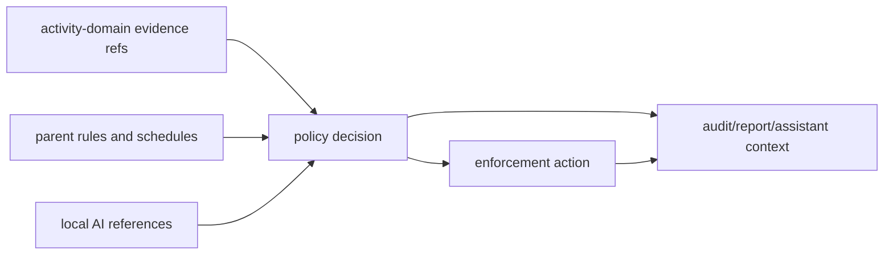

# @ocentra-parent/parent-domain

Shared product contracts for family safety, policy, enforcement, local AI, LAN,
mobile readiness, and control catalogs.

## Owns

- Parent/family/child/device product contracts.
- Policy rules, schedules, targets, decisions, permissions, and audit shapes.
- Enforcement intents, results, capability states, timers, and readiness.
- V0.8 enforcement product-control spine contracts that separate implemented,
  degraded, dry-run, manual-required, unavailable, and not-claimed states.
- V0.8 enforcement policy-dispatch contracts that validate parent-authored
  intents, evidence refs, adapter matrix rows, timer/approval/audit state, and
  child-facing reason codes before dispatch-ready claims.
- V0.8 enforcement integrity runtime audit contracts that link supported action
  results, timer recovery/rollback, child-status refs, parent-override audit
  refs, permission-loss, integrity heartbeat, and tamper/manual states.
- V0.8 integrity alert/status bridge contracts that expose permission-loss,
  stale-heartbeat, stopped-or-removed, and tamper/manual parent-visible status
  rows with notification intent/status refs, audit refs, integrity refs, and
  drill-in refs.
- V0.8 notification provider status boundary contracts that represent queued,
  delivered, failed, unavailable, and manual-required provider states plus
  quiet-hours/escalation readiness as read-model proof without provider
  delivery claims.
- Notification local outbox adapter-boundary contracts that represent a
  parent-owned local outbox artifact, minimal alert envelopes, provider-channel
  abstraction, quiet-hours defer, retry, dead-letter, receipt-required, and
  manual-required states without provider delivery, receipt ingestion,
  credentials, cloud routing, parent UI, or sensitive detail storage claims.
- Local AI runtime, provider, scheduler, context, and reference contracts.
- Parent assistant and action-preview contracts.
- LAN pairing, device roles, controller/observer states, and provider routing.
- Billing/subscription entitlement contracts for plan rows, subscription status,
  device-limit decisions, failure behavior, retained evidence export, and
  local-safety continuation without billing provider SDK ownership.
- Parent-owned sync/export and stateless report compiler status contracts for
  parent-authorized remote compilation from parent-owned storage, source
  connector/cursor refs, requested data classes and time windows, temp TTL and
  deletion confirmation, redaction/minimization, audit refs, and custody
  non-mutation boundaries.
- Parent-owned local export/delete runtime-state contracts for
  parent-authorized Windows local export queues, encrypted local output
  metadata, delete confirmation/failure, offline/manual states, source evidence
  retention for local safety, and no cloud/provider/UI/custody overclaims.
- App install/purchase runtime proof boundary contracts that link platform/store
  metadata requirements, package-source artifact requirements, child
  pending/result delivery rows, and report integration rows while keeping
  provider/store, child-device delivery, runtime report delivery, and app
  blocking unclaimed.
- V0.9 signed LAN discovery/relay spine contracts that keep adapter evidence,
  signed proof rejection, route safety, relay/cache availability, parent-owned
  storage, and child-data custody claims explicit.
- V0.9 LAN source-matrix plan-completion contracts that expose all 20 LAN
  workpacks and discovery source rows with honest proof statuses and weak-source
  fences.
- Browser/app/game/network/screen/tracking control catalogs.
- Android/iOS/platform proof and capability status contracts where product
  meaning belongs in TypeScript first.
- Tracking location policy, AI routing, acknowledgement, child check-in, alert
  intent, escalation, temporary live, and missing-device product contracts plus
  P1 acknowledgement/check-in runtime helper proof.

## Must Not Own

- Raw evidence payloads that belong in `activity-domain`.
- WebSocket envelopes that belong in `agent-protocol-domain`.
- Portal route/layout details.
- Platform adapter implementation.
- Billing provider SDK logic.

## Flow

## Connected Docs

- [Policy expectations](../../docs/expectations/policy.md)
- [Enforcement expectations](../../docs/expectations/enforcement.md)
- [AI expectations](../../docs/expectations/ai.md)
- [Parent assistant expectations](../../docs/expectations/parent-assistant-chat.md)
- [LAN pairing expectations](../../docs/expectations/lan-pairing.md)
- [Platform expectations](../../docs/expectations/platforms.md)
- [Competitor capability map](../../docs/competitor-capability-map.md)

## Gaps To Fill

- Family setup, child profiles, co-parent roles, and recovery need complete
  product contracts and UI flow.
- Social/message/video controls need explicit product contracts, privacy
  boundaries, and platform source rules.
- Location/geofence/SOS/battery now has tracking contract proof plus P1
  acknowledgement/check-in helper proof; platform adapters, provider delivery,
  notification delivery, and live UI proof remain open.
- Store/install approval and purchase controls now have contract, package-source
  artifact, and runtime-boundary proof; platform/store adapters, real
  child-device package artifacts, child delivery, portal UX, and report runtime
  delivery remain unimplemented.
- Billing/subscription provider integration, account backend, entitlement
  signing/delivery runtime, portal UI, and child-device consumption remain
  unimplemented; current contracts keep billing outside core safety decisions.
- Parent-owned sync/export and stateless report compiler proofs remain
  contract/status proof only; real compiler runtime/cloud worker, connector
  OAuth/provider APIs, portal controls/UI, upload/download, deletion execution,
  custody/security review, and real storage/cache implementation remain
  unclaimed.
- Parent-owned local export/delete runtime proof remains read-model proof only;
  real filesystem writers, retention schedulers, delete executors, durable audit
  persistence, physical Windows smoke proof, and parent-visible controls remain
  unclaimed.
- V0.8 broad app, network/domain, exact URL, notification, and tamper controls
  remain manual-required or not-claimed until platform adapter proof exists.
- Policy-dispatch proof is currently service/read-model proof; finished
  parent/child UX, notification delivery, network/domain blocking, broad app
  blocking, and tamper protection remain proof-gated gaps.
- Supported-adapter and integrity runtime audit proof remain contract/read-model
  proof; broad app/domain/browser blocking, notification delivery, tamper
  resistance, mobile enforcement, stealth/persistence, and privilege escalation
  remain unclaimed.
- Integrity alert/status bridge proof remains notification intent/status and
  audit drill-in proof only; provider delivery, UI, anti-tamper resistance,
  broad blocking, mobile enforcement, stealth/persistence, and privilege
  escalation stay unclaimed.
- Signed LAN hello/heartbeat and physical household readiness remain
  manual-required until real second-child-agent artifacts are attached.
- Notification provider status boundary proof remains status/readiness
  contract/read-model proof only; notification local outbox proof remains
  deterministic parent-owned JSONL artifact proof only; provider adapters,
  provider receipts, delivered receipt ingestion, retry execution, quiet-hours
  scheduling, escalation delivery, parent controls, notification UI, provider
  credentials, cloud routing, and production durable outbox storage remain
  unclaimed.
- LAN source-matrix proof is contract/read-model proof. It does not implement
  targeted ARP, bounded ARP sweep, packet listeners, real mDNS/SSDP
  advertisements, relay/cache, or physical household validation.
