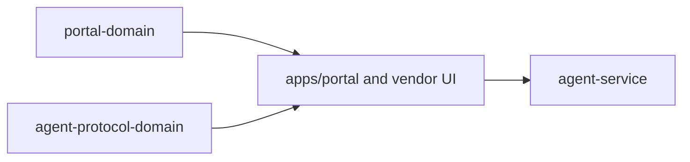

# @ocentra-parent/portal-domain

Presentation helpers for the parent portal surface.

## Owns

- Portal route ids and route groups used by the shell.
- DOM ids, labels, and presentation tokens that cross source and test
  boundaries.
- Parent portal nav and section descriptors.
- Shared detail labels and proof markers derived from Rust-owned state or read
  models.
- Thin UI intents and adapters that present Rust-owned data without claiming
  business logic, state mutation, policy execution, route snapshots, or
  enforcement.

## Must Not Own

- React rendering implementation.
- Runtime child-device state.
- Policy evaluation, AI execution, or enforcement.
- Evidence contracts.
- TS-owned product truth or mutation logic.

## Flow

## Connected Docs

- [Portal expectations](../../docs/expectations/portal.md)
- [Product capability checklist](../../docs/product-capability-checklist.md)

## Gaps To Fill

- Keep route and nav contracts aligned with real Rust-owned portal state.
- Keep the remaining route and row helpers as transitional presentation
  adapters only; do not treat them as product truth.
- Rebuild the package after source changes; ignored `dist/` can make local UI
  behavior stale.
- Keep presentation helpers thin and side-effect free.
- Add new package exports only when a real UI consumer needs them.
