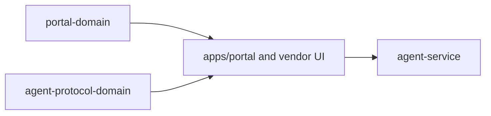

# @ocentra-parent/portal-domain

Shared portal route, DOM, navigation, service-state row, and dev command
contracts.

## Owns

- Portal route ids and route groups.
- DOM ids/test ids that cross source/test boundaries.
- Parent portal nav and section descriptors.
- Service-state display rows and dev command descriptors, including the
  tracking read-model refresh command consumed by the Policy Tracking route.
- Tracking hosted proof DOM markers and proof artifact refs consumed by the
  Policy Tracking route and Playwright proof harness.
- App/game notification parent-surface panel intent values derived from the
  parent-domain read model plus the live service notification-readiness
  projection, without claiming delivery, preference mutation, scheduler/outbox
  runtime, or adapter dispatch.
- App/game policy readiness route intents that render service-backed readiness
  summaries and rows without policy execution or adapter dispatch claims.
- Social dashboard panel intents that adapt parent-domain social dashboard
  snapshots into portal rows, or render an unavailable zero-row state when no
  service-backed social snapshot exists.
- Portal overview refresh command descriptors for service-backed network
  product-readiness status visibility, without defining policy or adapter
  authority.
- Shared detail labels for service-backed network platform-claim manifest rows,
  including OS/device refs, permission or entitlement refs, adapter capability
  refs, and false enforcement-command publication.

## Must Not Own

- React rendering implementation.
- Runtime child-device state.
- Policy evaluation, AI execution, or enforcement.
- Evidence contracts.

## Flow

## Connected Docs

- [Portal expectations](../../docs/expectations/portal.md)
- [Product capability checklist](../../docs/product-capability-checklist.md)

## Gaps To Fill

- Keep route/nav contracts aligned with real service-backed portal state.
- Rebuild the package after source changes; ignored `dist/` can make local UI
  behavior stale.
- Add route contracts for new product areas only after the expectation docs
  define the parent outcome.
- Keep app/game notification parent-surface projection aligned with future
  provider/preference/scheduler/outbox service rows before showing those refs as
  reported runtime state.
- Keep social dashboard rows unavailable until a real service-backed social
  snapshot path exists; do not promote connector/native/final-policy/enforcement
  claims from portal-only rendering.
- Keep network platform-claim labels tied to service-backed status rows only;
  do not promote manifest rendering into policy authority, adapter execution, or
  host filtering claims.
