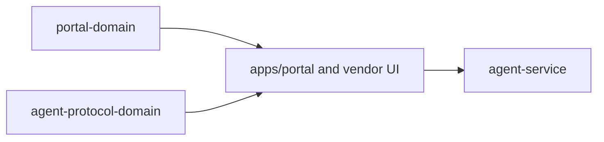

# @ocentra-parent/portal-domain

Shared portal route, DOM, navigation, service-state row, and dev command
contracts.

## Owns

- Portal route ids and route groups.
- DOM ids/test ids that cross source/test boundaries.
- Parent portal nav and section descriptors.
- Service-state display rows and dev command descriptors.

## Must Not Own

- React rendering implementation.
- Runtime child-device state.
- Policy evaluation, AI execution, or enforcement.
- Evidence contracts.

## Flow

## Connected Docs

- [Portal expectations](../../docs/expectations/portal.md)
- [Product capability checklist](../../docs/product-capability-checklist.md)

## Gaps To Fill

- Keep route/nav contracts aligned with real service-backed portal state.
- Rebuild the package after source changes; ignored `dist/` can make local UI
  behavior stale.
- Add route contracts for new product areas only after the expectation docs
  define the parent outcome.
