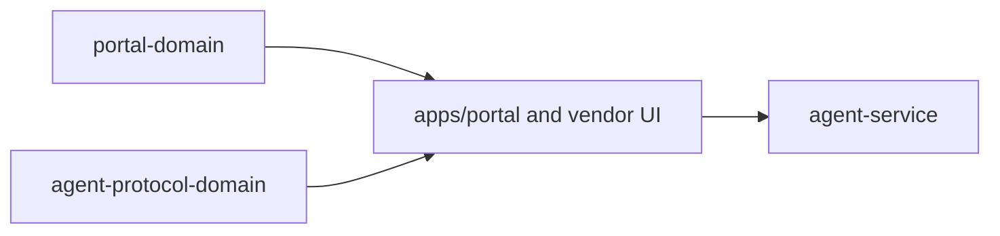

# @ocentra-parent/portal-domain

Shared portal route, DOM, navigation, service-state row, and dev command
contracts.

## Owns

- Portal route ids and route groups.
- DOM ids/test ids that cross source/test boundaries.
- Parent portal nav and section descriptors.
- Service-state display rows and dev command descriptors, including the
  tracking read-model refresh command consumed by the Policy Tracking route.
- Tracking hosted proof DOM markers and proof artifact refs consumed by the
  Policy Tracking route and Playwright proof harness.
- App/game notification parent-surface panel intent values derived from the
  parent-domain read model plus the live service notification-readiness
  projection, without claiming delivery, preference mutation, scheduler/outbox
  runtime, or adapter dispatch.
- App/game timer parent-surface parent preference setup request action metadata
  and payload construction for request-ready setup rows, without claiming
  durable preference mutation, notification rule writes, provider delivery,
  child delivery, adapter dispatch, or platform enforcement.
- App/game timer parent preference setup accepted-result detail rows for
  parent-safe action-result persistence, mutation receipt, child-runtime
  handoff, service-local child-runtime queue refs/status, and service-local
  child-runtime dispatch refs/status, without claiming child delivery, provider
  delivery, receipt ingestion, durable outbox runtime, adapter dispatch, broad
  blocking, platform enforcement, raw target values, or private diagnostics.
- App/game policy readiness route intents that render service-backed readiness
  summaries and rows without policy execution or adapter dispatch claims.
- Social dashboard panel intents that adapt parent-domain social dashboard
  snapshots into portal rows, or render an unavailable zero-row state when no
  service-backed social snapshot exists.
- Social audit/explanation panel intents that adapt schema-decoded SOCIAL-22
  proof bundles into parent-visible rows while keeping service-backed
  explanation delivery, notification delivery, connector authorization, native
  app control, policy execution, and enforcement unclaimed.

## Must Not Own

- React rendering implementation.
- Runtime child-device state.
- Policy evaluation, AI execution, or enforcement.
- Evidence contracts.

## Flow

## Connected Docs

- [Portal expectations](../../docs/expectations/portal.md)
- [Product capability checklist](../../docs/product-capability-checklist.md)

## Gaps To Fill

- Keep route/nav contracts aligned with real service-backed portal state.
- Rebuild the package after source changes; ignored `dist/` can make local UI
  behavior stale.
- Add route contracts for new product areas only after the expectation docs
  define the parent outcome.
- Keep app/game notification parent-surface projection aligned with future
  provider/preference/scheduler/outbox service rows before showing those refs as
  reported runtime state.
- Keep app/game timer parent-surface preference setup request actions limited to
  parent-safe refs until durable preference mutation and notification rule write
  paths exist.
- Keep accepted parent preference setup command-result details parent-safe; do
  not show child-runtime handoff, service-local queue readiness, or
  service-local dispatch readiness as actual delivery or platform enforcement.
- Keep social dashboard rows unavailable until a real service-backed social
  snapshot path exists; do not promote connector/native/final-policy/enforcement
  claims from portal-only rendering.
- Keep social explanation rows proof-bundle only until a real service-backed
  explanation read-model/event path exists; do not promote audit-store,
  notification, connector/native, final-policy, or enforcement claims from
  portal rendering.
