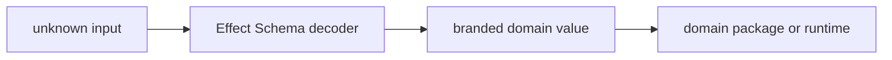

# @ocentra-parent/schema-domain

Generated/thin validation and edge-decoder boundary for TypeScript over Rust-owned contracts.

## Role

- Consume Rust-generated contract artifacts from `crates/schema`.
- Provide thin parsing helpers at untrusted TS edges.
- Keep temporary adapters small while Rust remains the contract authority.

## Must Not Own

- Canonical product-specific policy, evidence, route, or protocol contracts.
- Manual `string & { readonly __brand: ... }` aliases.
- Zod or parallel validation frameworks.
- TS business authority, fallback behavior, or canonical schema ownership.

## Flow

## Connected Docs

- [Contract expectations](../../docs/expectations/contracts.md)
- [Code quality expectations](../../docs/expectations/code-quality.md)

## Gaps To Fill

- Keep helpers small and generic.
- Add helper docs only when repeated contract patterns emerge.
- Retire TS adapters once Rust-owned replacements are live, bridge-exposed, and consumed.
