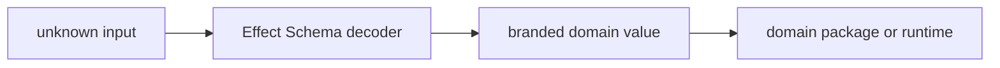

# @ocentra-parent/schema-domain

Shared Effect Schema boundary for branded types and decode helpers.

## Owns

- Effect Schema helper exports.
- Branded decode patterns used by other domain packages.
- The repo-wide validation style for TypeScript runtime parsing.

## Must Not Own

- Product-specific policy, evidence, route, or protocol contracts.
- Manual `string & { readonly __brand: ... }` aliases.
- Zod or parallel validation frameworks.

## Flow

## Connected Docs

- [Contract expectations](../../docs/expectations/contracts.md)
- [Code quality expectations](../../docs/expectations/code-quality.md)

## Gaps To Fill

- Keep helpers small and generic.
- Add helper docs only when repeated contract patterns emerge.
