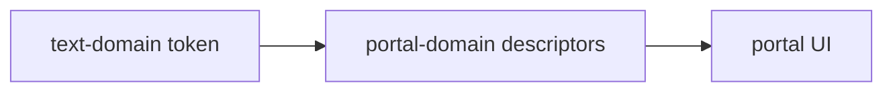

# @ocentra-parent/text-domain

Schema-backed display text tokens and shared copy values.

## Owns

- Shared text values that runtime surfaces need to render consistently.
- Dev portal copy tokens that should not live as loose app strings.
- Dev portal command labels for service-backed network readiness refreshes.
- Text schemas for copy that crosses packages or tests.

## Must Not Own

- Arbitrary page prose that is local to documentation.
- Policy ids, route ids, event names, or protocol values.
- Product decisions hidden inside wording.

## Flow

## Connected Docs

- [Contract expectations](../../docs/expectations/contracts.md)
- [Portal expectations](../../docs/expectations/portal.md)

## Gaps To Fill

- Expand only when text is reused or contract-visible.
- Keep parent-facing product language aligned with the README and constitution.
