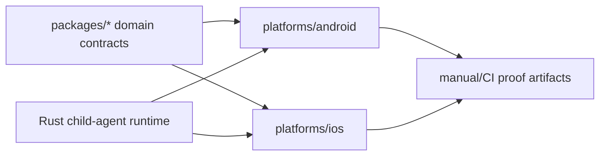

# Platforms

The `platforms/` workspace contains mobile/platform package scaffolds and proof
paths. A platform package is not the same as platform product support.

## Platform Claim Rule

Every platform capability must say whether it is `done`, `in progress`,
`scaffold-only`, `manual-required`, `degraded`, `blocked`, or `not started`.

Package build or simulator launch proof can support a scaffold claim. It cannot
claim child-device monitoring, background execution, enforcement, app blocking,
network filtering, location, notification delivery, or store readiness.

## Connected Docs

- [Platform expectations](../docs/expectations/platforms.md)
- [Platform deliverables expectations](../docs/expectations/platform-deliverables.md)
- [Mobile agents roadmap expectations](../docs/expectations/roadmap-v6-mobile-agents.md)
- [Product capability checklist](../docs/product-capability-checklist.md)

## Current Gaps

- Android now has local emulator scaffold proof for package install, launch,
  status surface, and foreground-service visibility through
  `npm run test:tracking-plan-platform-local-proof`; privileged behavior,
  location/geofence/background behavior, and physical-device behavior remain
  unproved.
- iOS needs entitlement, signing, and approved API proof before child-agent
  claims.
- Parent mobile and child mobile are separate products and must not be merged
  into one vague "mobile support" claim.
